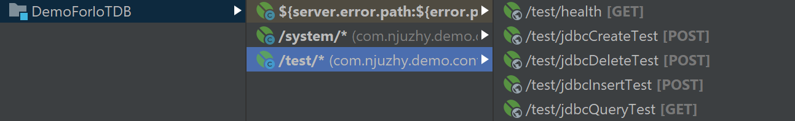
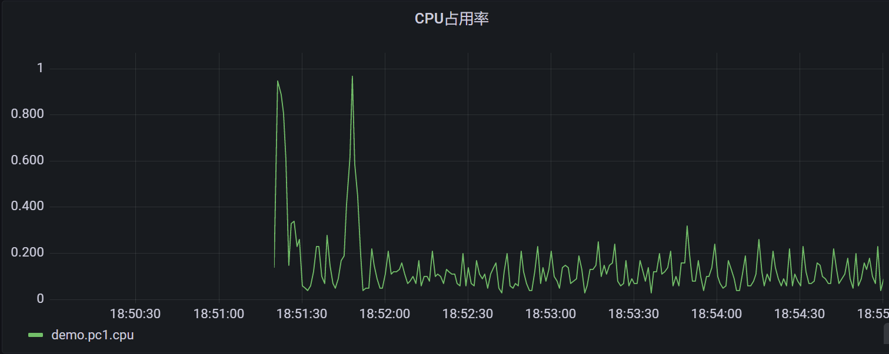
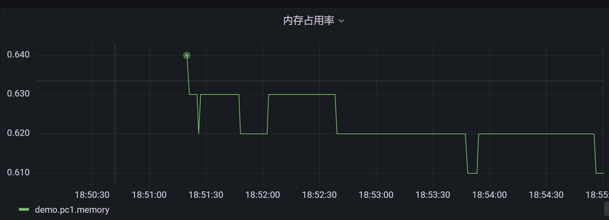

Spring-Boot-IoTDB
---
1. 本文主要描述了使用JDBC连接IoTDB完成CPU数据的实时采集，并提供了REST API查询和Grafana可视化查看的过程
2. 项目代码地址：https://github.com/stormbroken/Spring-Boot-IoTDB

<!-- TOC -->

- [1. 实验环境](#1-实验环境)
- [2. 项目环境接口说明](#2-项目环境接口说明)
  - [2.1. 连接测试](#21-连接测试)
  - [2.2. 系统数据采样](#22-系统数据采样)
- [3. 配置文件说明](#3-配置文件说明)
- [4. 核心代码说明](#4-核心代码说明)
  - [4.1. POJO类：MySystemInfo](#41-pojo类mysysteminfo)
  - [4.2. 连接JDBC：IoTDBService](#42-连接jdbciotdbservice)
  - [4.3. 定时采样任务](#43-定时采样任务)
- [5. 与Grafana连接](#5-与grafana连接)

<!-- /TOC -->

# 1. 实验环境
1. 操作系统：Windows 10
2. JDK版本：1.8
3. Spring Boot：2.5.2
4. IoTDB 版本：0.12.1，启动端口6667
5. Grafana 版本：8.0.4，启动端口8081

# 2. 项目环境接口说明

## 2.1. 连接测试


1. /test/health：检查应用心跳
2. /test/jdbcCreateTest：创建测试用存储组
3. /test/jdbcInsertTest：创建测试插入数据
4. /test/jdbcQueryTest：创建测试查询接口
5. /test/jdbcDeleteTest：删除测试用存储组
6. 上述接口在测试过程中可以按照字面顺序执行查看返回结果和报错。

## 2.2. 系统数据采样


1. /system/init：初始化创建系统采样用存储组
2. /system/findAll：查询所有的采样结果数据
3. /system/delete：删除系统采样用存储组

# 3. 配置文件说明
1. 核心配置文件为pom.xml文件，请进入Github项目查看具体配置。
2. 其中需要注意iotdb-jdbc不要使用0.13版本，会报错失败，本项目使用的为0.12.1版本。

```xml
<dependency>
    <groupId>org.apache.iotdb</groupId>
    <artifactId>iotdb-jdbc</artifactId>
    <version>0.12.1</version>
</dependency>
```

# 4. 核心代码说明

## 4.1. POJO类：MySystemInfo
```java
@Data
public class MySystemInfo {
    // 内存使用率
    Double memoryUsage;
    // CPU使用率
    Double cpuUsage;
    // 磁盘使用率
    Double diskUsage;
    // 采样时间 ms
    Long time;
}
```

## 4.2. 连接JDBC：IoTDBService
1. 该服务主要负责将Spring应用通过JDBC与IoTDB进行连接
2. 遇到的问题
   1. Query的结果集输出报错SQLException(400)：请检查是否在输出之前将Statement或Connection关闭
   2. 请在使用完成ResultSet后将其关闭，避免过多未关闭连接降低查询性能。

```java
/**
 * @Author stormbroken
 * Create by 2021/07/07
 * @Version 1.0
 **/

@Service
public class IoTDBService {
    @Value("${iotdb.url}")
    String url;
    @Value("${iotdb.username}")
    String username;
    @Value("${iotdb.password}")
    String password;

    /**
     * 建立连接
     */
    Connection connection;

    public void getConnection() throws ClassNotFoundException, SQLException {
        if(connection == null){
            synchronized (this){
                if(connection == null){
                    Class.forName("org.apache.iotdb.jdbc.IoTDBDriver");
                    connection = DriverManager.getConnection(url, username, password);
                }
            }
        }
    }

    /**
     * 新建Statement后执行语句
     * @param statementStr
     * @return
     * @throws ClassNotFoundException
     * @throws SQLException
     */
    public boolean executeStatement(String statementStr)
            throws ClassNotFoundException, SQLException{
        Statement statement = getStatement();
        return statement.execute(statementStr);
    }

    /**
     * 新建Statement后执行一批语句
     * @param statements
     * @return
     * @throws ClassNotFoundException
     * @throws SQLException
     */
    public void executeStatements(List<String> statements)
            throws ClassNotFoundException, SQLException{
        Statement statement = getStatement();
        for(String statementStr: statements){
            statement.addBatch(statementStr);
        }
        statement.executeBatch();
    }

    /**
     * 按照查询语句进行查询
     * @param query
     * @param fetchSize
     * @return
     * @throws ClassNotFoundException
     * @throws SQLException
     */
    public ResultSet executeQuery(String query, Integer fetchSize)
            throws ClassNotFoundException, SQLException{
        Statement statement = getStatement();
        statement.setFetchSize(fetchSize);
        return statement.executeQuery(query);
    }

    /**
     * 插入一条系统数据
     * @param statement
     * @param mySystemInfo
     * @return
     * @throws ClassNotFoundException
     * @throws SQLException
     */
    public boolean insertSystemInfo(String statement, MySystemInfo mySystemInfo)
            throws ClassNotFoundException, SQLException{
        PreparedStatement preparedStatement = getPreparedStatement(statement);
        preparedStatement.setLong(1, mySystemInfo.getTime());
        preparedStatement.setDouble(2, mySystemInfo.getMemoryUsage());
        preparedStatement.setDouble(3, mySystemInfo.getCpuUsage());
        preparedStatement.setDouble(4, mySystemInfo.getDiskUsage());

        return preparedStatement.execute();
    }

    /**
     * 输出结果集
     * @param resultSet
     * @throws SQLException
     */
    public String outputResult(ResultSet resultSet) throws SQLException {
        StringBuilder stringBuilder = new StringBuilder();
        if (resultSet != null) {
            stringBuilder.append("--------------------------");
            final ResultSetMetaData metaData = resultSet.getMetaData();
            final int columnCount = metaData.getColumnCount();
            for (int i = 0; i < columnCount; i++) {
                stringBuilder.append(metaData.getColumnLabel(i + 1));
                stringBuilder.append(" ");
            }
            stringBuilder.append("\n");
            while (resultSet. next()) {
                StringBuilder builder = new StringBuilder();
                for (int i = 1; ; i++) {
                    builder.append(resultSet.getString(i));
                    if (i < columnCount) {
                        builder.append(", ");
                    } else {
                        builder.append("\n");
                        break;
                    }
                }
                stringBuilder.append(builder);
            }
            stringBuilder.append("--------------------------\n\n");
        }
        return stringBuilder.toString();
    }

    /**
     * 获取 Statement 进行执行
     * @return
     * @throws ClassNotFoundException
     * @throws SQLException
     */
    private Statement getStatement()
            throws ClassNotFoundException, SQLException{
        getConnection();
        return connection.createStatement();
    }

    /**
     * 获取 PreparedStatement 进行执行
     * @param statement
     * @return
     * @throws ClassNotFoundException
     * @throws SQLException
     */
    private PreparedStatement getPreparedStatement(String statement)
            throws ClassNotFoundException, SQLException{
        getConnection();
        return connection.prepareStatement(statement);
    }
}
```

## 4.3. 定时采样任务
1. 本部分使用了定时任务，1秒钟采样一次。
2. 采样结束后进行写库。

```java
@Scheduled(cron = "* * * * * *")
public void updateInfo() throws ClassNotFoundException, SQLException {
    MySystemInfo mySystemInfo = new MySystemInfo();
    mySystemInfo.setCpuUsage(getCpuUsage());
    mySystemInfo.setDiskUsage(getDiskUsage());
    mySystemInfo.setMemoryUsage(getMemoryUsage());
    mySystemInfo.setTime(System.currentTimeMillis());

    systemService.insert(mySystemInfo);
}
```

# 5. 与Grafana连接
1. 参考<a href = "https://iotdb.apache.org/zh/UserGuide/V0.9.x/7-Ecosystem%20Integration/1-Grafana.html">官网文献</a>完成配置
2. 将Grafana和IoTDB完成连接需要按如下操作
   1. 安装并启动Grafana
   2. 安装并启动IoTDB
   3. 安装Grafana插件simple-json，并重启Grafana
   4. 启动<a href = "https://github.com/apache/iotdb/tree/master/grafana">Grafana</a>连接器
   5. 启动已经编写好的Spring应用程序
   6. 进入Grafana按照用户手册配置Data Source创建对应面板，最终效果如下所示：



